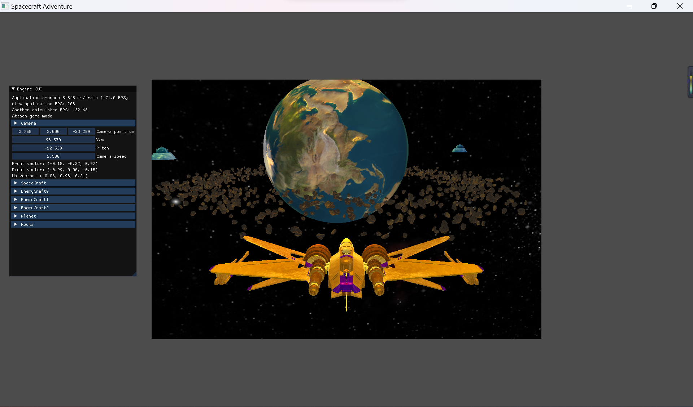
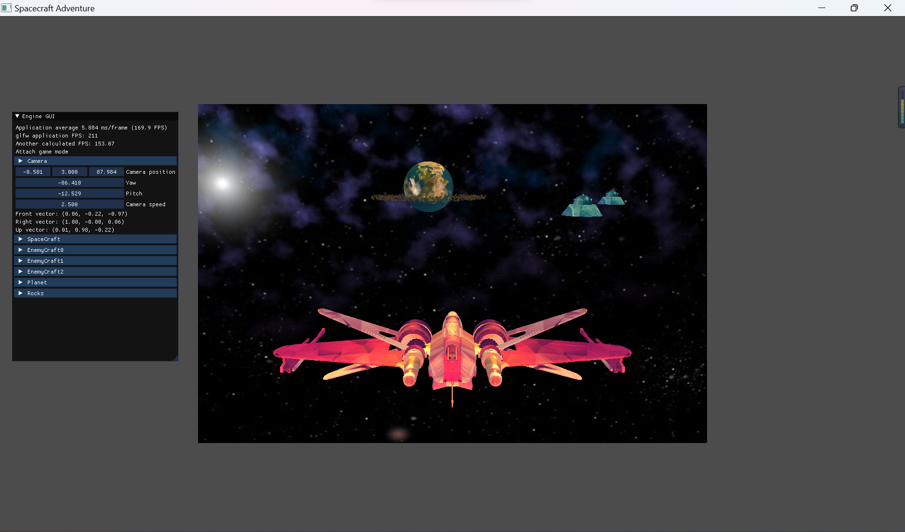

# Space Adventure Game - OpenGL

### What you can do in the application

When you first enter the application, you are in the movement free camera mode, where you can move the mouse around and click the UI to change the parameters in the game. So in this game, you are totally free to cheat. Press Tab to toggle the camera mode. One tab leads to the all free camera modem, where you can rotate the camera and wander around the world with the keyboard. Two tabs lead to the game mode, where you can control the spacecraft to move around, hide from the enemies and collect the treasures.

### Features

Features implemented in the application include:

- Keyboard and mouse interaction
- Normal mapping (planet)
- Phong shading
- Instance rendering (rocks around the planet)
- Skybox

### Screenshots

